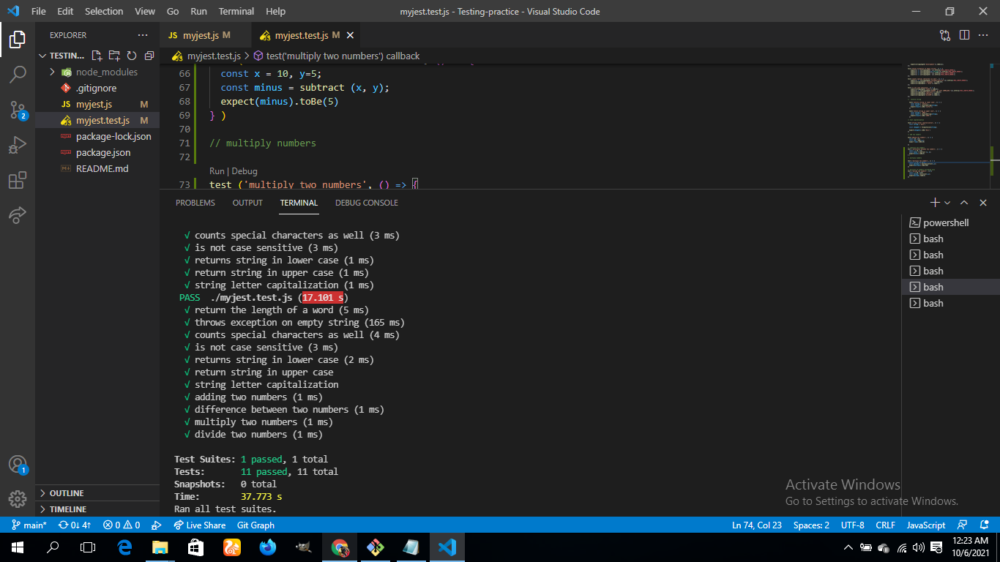

# Project Name

Testing with Jest

> This project is based on testing using the jest framework
> 

Additional description about the project and its features.

- All test should pass
- Test descriptions should be met
- wrong test should be detected.

## Built With

- 
- 
-  
- 
- 

👤 **Author**
- Name: Tufoin Nkuo
- GitHub: [@tufoinnkuo10](https://github.com/tufoinnkuo10)
- Twitter: [@itztenten](https://twitter.com/itztenten)
- LinkedIn: [LinkedIn](https://www.linkedin.com/in/tufoin-nkuo-3b272320b)

## 🤝 Contributing

Contributions, issues, and feature requests are welcome!

Feel free to check the [issues page](../../issues/).

## Show your support

Give a ⭐️ if you like this project!

## Acknowledgments

- This project is realised thanks to microverse

## 📝 License

This project is [MIT](./LICENSE.md) licensed.
